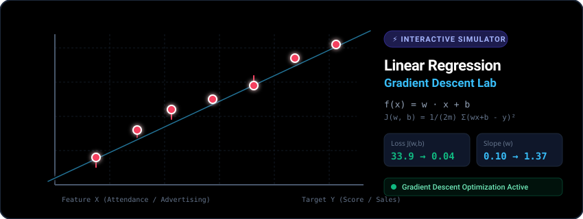

# 📈 Linear Regression Simulator & Gradient Descent Lab

An interactive, high-performance web-based simulator for **Linear Regression** and **Gradient Descent Optimization**. Grounded directly in the mathematical formulation and training logic from [`Linear_Regression.ipynb`](https://github.com/hammadshakeelai/Machine-Learning/blob/main/Programming-for-AI/Linear_Regression.ipynb), benchmarked against **Seeing Theory** (Brown University), **Google ML Crash Course / TensorFlow Playground**, and **Stanford CS229** (Andrew Ng).

[](https://hammadshakeelai.github.io/linear-regression-simulator/)


🌐 **Live Website**: [https://hammadshakeelai.github.io/linear-regression-simulator/](https://hammadshakeelai.github.io/linear-regression-simulator/)



---

## 🚀 Key Features

### 🎛️ Dual-Stage Architecture (Data Space ↔ Parameter Space)
- **Side-by-Side Synchronized Canvases**:
  - **Canvas 1 (Data Space)**: Interactive coordinate plane with draggable data points, live fitted hypothesis $f(x) = wx + b$, color-coded residual stems, toggleable geometric error squares $\sum (wx_i + b - y_i)^2$, and analytical OLS best-fit guide line.
  - **Canvas 2 (Parameter Space)**: 2D elliptical loss contour surface of $J(w, b)$ with an animated parameter ball rolling downhill into the global minimum $\min J$, trajectory history trail, and click-to-relocate parameter positioning.

### ⚡ Rock-Solid Gradient Descent Simulation Engine
- **Intuitive Default Calibration**: Starts with a Seeing Theory-benchmark dataset ($x \in [1, 10]$) that converges visibly and smoothly in 25–35 frames right before your eyes.
- **Automatic Coordinate Conditioning / Feature Scaling**: Automatically enables Z-score normalization on unscaled datasets (e.g. `student_performance.csv` where $x \in [65, 98]$) so that gradient descent converges rapidly without freezing or exploding.
- **Multi-Optimizer Algorithms**:
  - **Batch GD**: Full dataset gradient descent directly matching the notebook.
  - **Stochastic GD (SGD)**: Single-sample noisy zigzag descent.
  - **Mini-Batch GD**: 50% random batch sampling.
  - **Momentum ($\beta=0.9$)**: Velocity acceleration that speeds through plateaus and ravines.
- **Web Audio Sonification**: Optional real-time audio tone whose pitch maps to cost $J(w, b)$ — descending from high alert pitch to a calm resonant hum as the model converges.
- **Circuit Breaker Banner**: Graceful non-blocking warning with an "Auto-Fix & Reset" button if a user experiments with an excessively high learning rate.

### 💻 VS Code-Like Interactive Code Box & Execution Debugger
- **Integrated IDE Panel**: Styled like VS Code with syntax-highlighted Python code directly mirroring your original implementation.
- **In-Code Editable Parameters**: Modify $w$, $b$, $\alpha$, epochs, cost factor ($1/2m$ vs $1/m$), and print frequency directly inside the code lines!
- **Line-by-Line Debugger Highlight**: Follows the execution flow of the inner loops and parameter updates in real time:
  - `diff = (w * Xi + b - Yi)`
  - `total_wxbyx += diff * Xi`
  - `total_wxby += diff`
  - `squared_total_wxby += diff ** 2`
  - `jwb = (1 / (2*m)) * squared_total_wxby`
  - `temp_w = w - alpha * (1/m) * total_wxbyx`
  - `temp_b = b - alpha * (1/m) * total_wxby`
- **Live Scalar Inspector**: Real-time table displaying exact numerical values of all running sums, gradients, and model quality metrics ($MSE$, $RMSE$, $MAE$, $R^2$).

### 🎯 Interactive Prediction Playground
- Test arbitrary input feature values $x$ with live evaluation of hypothesis $f(x) = wx + b$.
- Projects a cyan laser crosshair and glowing reticle target directly onto the regression canvas at $(x, \hat{y})$.

### 📊 Dataset Management & Interactive Canvas
- **Preloaded Datasets**:
  - `Intuitive Linear (Seeing Theory Benchmark)` ($x \in [1, 10]$)
  - `Student Attendance vs Exam Score` (from `student_performance.csv`)
  - `Study Hours vs Exam Score` (from `student_performance.csv`)
  - `Advertising vs Sales` (10-year dataset from notebook Cell 5)
  - `Outlier Sensitivity Test` (Seeing Theory classic)
- **Touch & Mouse Support**: Full touch drag support for smartphones and tablets (`touch-action: none`) and desktop cursor controls.
- **Custom CSV Upload**: Drop your own CSV files and automatically parse numeric columns.

---

## 📐 Mathematical Formulation

Directly derived from Stanford CS229 / Andrew Ng and your Jupyter Notebook:

### 1. Hypothesis Function
$$f_{w,b}(x) = w \cdot x + b$$

### 2. Cost Function (Mean Squared Error with $\frac{1}{2m}$)
$$J(w, b) = \frac{1}{2m} \sum_{i=1}^{m} \left(f_{w,b}(x^{(i)}) - y^{(i)}\right)^2 = \frac{1}{2m} \sum_{i=1}^{m} (w \cdot x^{(i)} + b - y^{(i)})^2$$

### 3. Partial Derivatives (Gradients)
$$\frac{\partial J(w,b)}{\partial w} = \frac{1}{m} \sum_{i=1}^{m} (w \cdot x^{(i)} + b - y^{(i)}) \cdot x^{(i)} \quad \text{(Notebook: } \texttt{total\_wxbyx / m}\text{)}$$

$$\frac{\partial J(w,b)}{\partial b} = \frac{1}{m} \sum_{i=1}^{m} (w \cdot x^{(i)} + b - y^{(i)}) \quad \text{(Notebook: } \texttt{total\_wxby / m}\text{)}$$

### 4. Simultaneous Parameter Updates
$$w := w - \alpha \frac{\partial J(w,b)}{\partial w}$$
$$b := b - \alpha \frac{\partial J(w,b)}{\partial b}$$

---

## 🛠️ Tech Stack

- **Frontend**: React 18, TypeScript, Tailwind CSS
- **Hooks & State**: Custom `useLinearRegression` hook
- **Icons**: Lucide React
- **Graphics & Visualizations**: High-performance SVG + HTML5 Canvas
- **Audio**: Web Audio API Synthesizer
- **Bundler & Build Tool**: Vite 5
- **Python Companion**: NumPy, Pandas, Matplotlib

---

## 📦 Project Structure

```
linear-regression-simulator/
├── .agents/
│   ├── hooks.json                    # Antigravity continuous execution lifecycle hook
│   └── continue_hook.cjs             # Safe autonomous worker controller
├── public/
│   └── student_performance.csv       # Preloaded dataset for download/test
├── src/
│   ├── components/
│   │   ├── Navbar.tsx                # Mode switcher (Part 1 vs Part 2) & actions
│   │   ├── RegressionCanvas.tsx      # Canvas 1: Data space with points, residuals & error squares
│   │   ├── CostContour.tsx           # Canvas 2: Parameter space with 2D contour & descent ball
│   │   ├── TrainingControls.tsx      # Playback hub, optimizers, sound & hyperparameter sliders
│   │   ├── ManualControls.tsx        # Manual parameter sliders & fit score gauge
│   │   ├── VSCodeEditor.tsx          # VS Code style editor with live debugger highlight
│   │   ├── LossChart.tsx             # Real-time J(w, b) loss curve
│   │   ├── PredictionPlayground.tsx  # Inference test box with laser crosshair
│   │   ├── DatasetSelector.tsx       # Presets, CSV upload, point manager
│   │   ├── AnimatedHeroBanner.tsx    # Looping SVG video-like hero banner
│   │   ├── MathModal.tsx             # Formula and derivation inspector
│   │   └── PythonExportModal.tsx     # Standalone Python script exporter
│   ├── hooks/
│   │   └── useLinearRegression.ts    # Comprehensive custom hook managing state & optimization
│   ├── core/
│   │   └── linearRegression.ts       # Mathematical engine, OLS, normalization
│   ├── data/
│   │   └── defaultDatasets.ts        # Presets (Intuitive Linear, student_performance, etc.)
│   ├── App.tsx                       # Master application component with dual-canvas stage
│   ├── index.css                     # Tailwind directives
│   └── main.tsx                      # App entry point
├── linear_regression.py              # Standalone Python CLI script matching notebook
├── student_performance.csv           # Original student dataset
├── banner.svg                        # Animated video-like SVG banner for GitHub & web
├── index.html                        # HTML template
├── package.json                      # Node dependencies & build scripts
├── tsconfig.json                     # TypeScript configuration
├── vite.config.ts                    # Vite configuration
└── README.md                         # Project documentation
```

---

## 🏃 Quick Start Guide

### Prerequisites
- [Node.js](https://nodejs.org/) (v18 or higher)
- [Python 3.8+](https://python.org/) (optional, for running offline Python script)

### 1. Install Dependencies
```bash
npm install
```

### 2. Run Local Development Server
```bash
npm run dev
```
Open your browser at `http://localhost:5173`.

### 3. Build for Production
```bash
npm run build
```
The optimized static bundle will be generated in `dist/`.

### 4. Run Companion Python Script
```bash
python linear_regression.py
```

---

## 🤝 Attribution & Credits

- Original Linear Regression implementation and datasets by [Hammad Shakeel](https://github.com/hammadshakeelai/Machine-Learning).
- Conceptual foundations: Stanford University CS229 / Supervised Machine Learning by Andrew Ng & Seeing Theory by Brown University.
